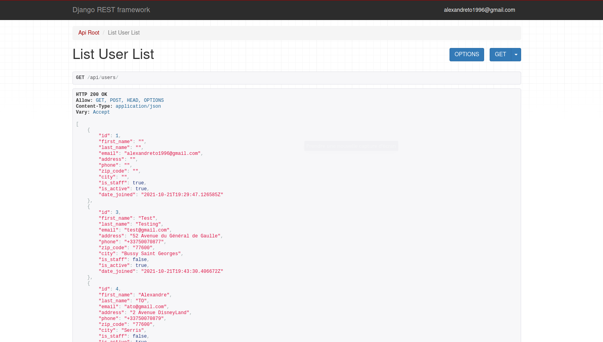
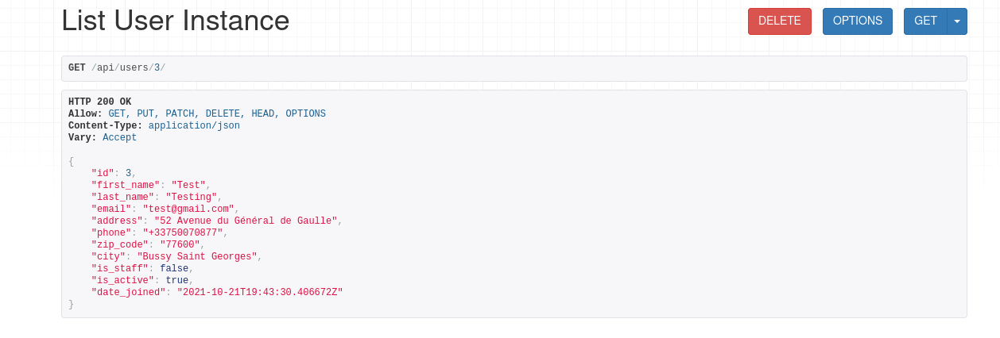
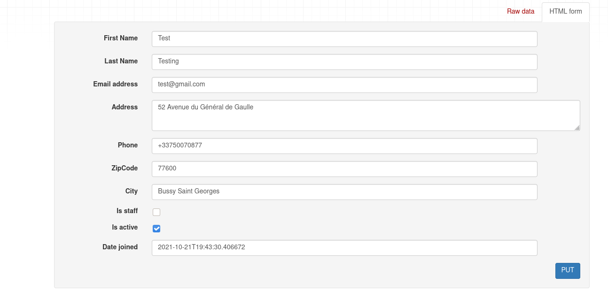

# API

Pour accéder à l'APi, il faut lancer le serveur local et aller sur ce lien 
`http://127.0.0.1:8000/api/users`

Cela va vous rediriger vers l'api de notre future site internet.

Voici des screenshots sur le début de l'api :

> **GET**

> **POST**

> **DELETE**

> **PUT**

Il faut manuellement taper l'id de l'utilisateur pour pouvoir accès au **DELETE** et au **PUT** (par exemple : `http://127.0.0.1:8000/api/users/1`).